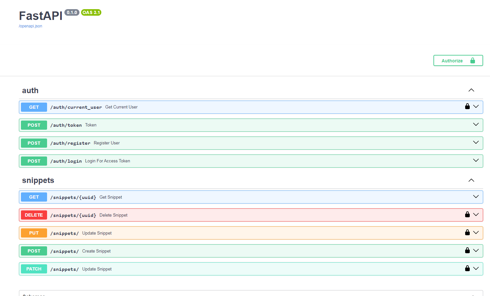

# API Snippet Codes
API для приложения, которое позволяет генерировать код-сниппеты

## Содержание
- [Описание](#описание)
- [Установка, настройка и запуск](#установка-настройка-и-запуск)
- [Файловая структура проекта](#файловая-структура-проекта)

## Стек технологий
- fastapi
- sqlalchemy
- alembic
- asyncpg
- python-jose[cryptogrphy]
- passlib[bcrypt]

## Описание
Данный проект был разработан с целью изучения основных возможностей и особенностей фреймворка FastAPI.\
Пройти процесс разработки API, понять, как выстраивать архитектуру приложения на данном фреймворке 
и работать с асинхронными эндпоинтами.

**Техническое задание**\
<i>Разработать API-приложение для демонстрации код-сниппетов (фрагментов кода).\
API для создания и распространения код-сниппетов позволяет пользователям писать, 
сохранять и делиться фрагментами кода.

Функционал приложения:
- В приложении реализована система аутентификации и авторизации пользователей.
- Авторизованный пользователь может создавать, смотреть, редактировать и удалять код-сниппеты.
- Создав код-сниппет, пользователь может отправить ссылку или uuid другому пользователю. 
Другой пользователь может запросить код-сниппет по uuid без авторизации.
- Все данные пользователей и код-сниппеты хранятся в базе данных.
- В приложении реализована система логирования и обработки ошибок.
</i>

**Что в проекте:**
- Реализована асинхронная работа с базой данных через SQLAlchemy и настроины миграции через alembic;
- Создана система аутентификации пользователей с помощью JWT-токенов;
- Созданы асинхронные эндпоинты для работы с код-сниппетами. 
  - В эндпоинтах есть валидация через библиотеку Pydantic и настройка прав доступа для пользователей;
- Настроена обработка ошибок на уровне всего приложения c помощью функции middleware и 
централизованно протоколирование с помощью модуля logging;
- Написаны асинхронные тесты;

## Установка, настройка и запуск
1. Убедитесь, что у вас установлен python версии 3.8.
2. Клонируйте этот репозиторий: `https://github.com/SvetlanaKrasnova/api_snippet_codes.git`
3. Создайте venv. Активируйте и установите необходимые библиотеки:
~~~python
pip install poetry
poetry update
~~~
4. Настройте конфиг (.env). Необходимо указать настройки для подключения к БД **postgres**
5. Выполните миграции
~~~python
alembic upgrade head
~~~

## Файловая структура
~~~python
api_snippet_codes/
├── alembic/
│   ├── ...
├── alembic.ini
├── logs/
│   ├── ...
├── poetry.lock
├── pyproject.toml
├── pytest.ini
├── README.md
├── src/ # кода, который непосредственно относится к приложению
│   ├── api/ # роуты
│   │   └── v1/ # версионирование
│   │       ├── auth.py
│   │       └── snippet.py
│   ├── core/ # для описания настроек проекта, секретов и настроек сторонних библиотек
│   │   ├── config.py # Настройки проекта
│   │   └── logger.py
│   ├── db/ # настройками и классами для работы с базой данных
│   │   └── db.py
│   ├── dependencies/
│   │   ├── ... # Зависимости
│   ├── exceptions.py
│   ├── main.py
│   ├── models/ # Описание моделий БД
│   │   ├── ...
│   ├── schemas/ # схемы для работы с API
│   │   ├── ...
│   ├── services/ # Сюда вынесена бизнес-логика приложения по сбору/проверки необходимых данных
│   │   ├── auth.py
│   │   └── snippet.py
├── tests/
│   ├── conftest.py
│   ├── test_db_auth.py # Тесты регистрации и аутентификации пользователей
│   ├── test_db_snippet.py # Тесты создания, обновления, удаления сниппетов
│   └── tests_routers_snippet.py # Тесты роутов
~~~
